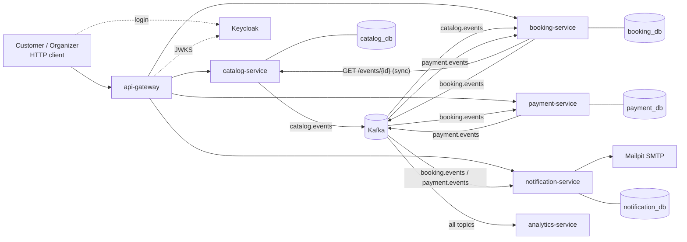
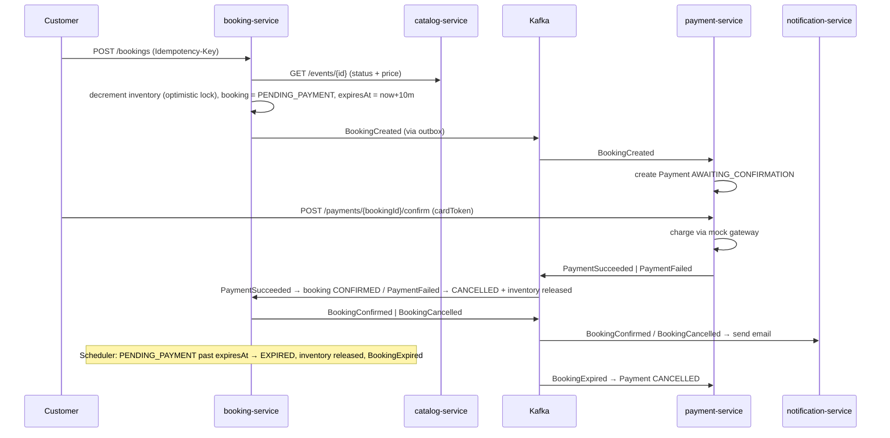

# Ticketly — Event Ticketing Platform

**Project type:** Learning project, built feature by feature
**Purpose:** Regain fluency in modern Java (21 → 25) and Spring Boot 4.x, and rehearse senior-level backend topics (JPA, records, microservices, Kafka, OIDC security, deployment, observability)
**Document version:** 1.0 — September 2026
**How to use this file:** Each feature has an ID (`F-01`, `F-02`, …). Build them **in order**, one at a time. When you use an AI assistant, give it this file plus the single feature ID you are working on (see §14 for a prompt template). Do not let it build ahead.

---

## Table of contents

1. Business context and vision
2. Why microservices (the business justification)
3. System architecture
4. Technology stack
5. Repository and project conventions
6. Records vs. entities — the rules for this project
7. Domain model per service
8. Kafka topics and event contracts
9. Security model (Keycloak / OIDC)
10. Feature backlog — Phase 0 to Phase 7
11. Deployment plan
12. Observability plan
13. Testing strategy
14. Working with an AI assistant on this project
15. Concept-to-feature learning map (interview preparation)
16. Glossary

---

## 1. Business context and vision

### 1.1 The business

Ticketly is a B2B2C platform. **Organizers** (concert promoters, conference hosts, theatres, sports clubs) create events and sell tickets. **Customers** browse events, book tickets, pay, and receive confirmations. **Ticketly staff (admins)** moderate the catalog and support customers.

Ticketly earns a commission on each confirmed booking. Its reputation depends on three things:

1. **Never overselling.** If a venue has 500 seats in the "Gold" tier, exactly 500 tickets may be sold, even when 50,000 people click "Book" in the same second when a popular artist goes on sale.
2. **Fast, reliable checkout.** A customer who holds seats must be able to pay within a short window; if they do not, the seats go back on sale.
3. **Trustworthy communication.** Every confirmed, failed, or expired booking produces a notification to the customer, and organizers see accurate live sales numbers.

### 1.2 Core user journeys

| Actor | Journey |
|---|---|
| Organizer | Create a venue → create an event in DRAFT → add ticket tiers with prices and quantities → publish → watch sales → cancel if necessary |
| Customer | Browse published events (filter by city/date) → check availability → book N tickets of a tier (seats are held) → pay within 10 minutes → receive confirmation email → view/cancel own bookings |
| Admin | See any booking, cancel abusive events, view notification delivery logs and platform stats |
| System | Expire unpaid holds, release inventory, notify, aggregate statistics |

### 1.3 Non-functional goals (learning-oriented but realistic)

- **Correctness under concurrency:** no oversell, ever. Verified by an automated concurrent test.
- **Resilience:** payments or notifications being down must not stop customers from browsing or holding seats.
- **Idempotency:** retrying a "book" or "pay" request must not create duplicates.
- **Observability:** every request is traceable end-to-end across services and through Kafka.
- **Deployability:** the whole platform starts with one `docker compose up`; later, optionally, on a local Kubernetes cluster.
- **Security:** every non-public endpoint requires a valid OIDC-issued JWT; authorization is role- and ownership-based.

---

## 2. Why microservices (the business justification)

A monolith would work for a small ticket shop. Ticketly is deliberately modeled as a business that has **outgrown** a monolith, so that the architectural pressure is real, not decorative. Keep these arguments in mind — they are exactly what an interviewer asks when they say *"why did you split it?"*

| Business pressure | Architectural consequence |
|---|---|
| **Different load profiles.** Browsing the catalog is read-heavy and cacheable (millions of views). Booking is write-heavy with contention and spikes 1000× during an on-sale. | Catalog and Booking scale independently. Booking gets more instances and DB capacity during on-sales; Catalog gets a cache and read replicas. |
| **Different risk profiles.** Payment code changes must be reviewed by a compliance-minded team and deployed rarely. Notification templates change weekly. | Separate deployables with separate release cadences. A notification bug can never take down payments. |
| **Failure isolation.** The email provider is down twice a month. The payment provider has 30-second latency spikes. | Asynchronous, event-driven integration via Kafka: a booking is accepted even if the email service is down; the email is sent when it recovers. |
| **Team ownership.** Three teams (Catalog, Checkout = Booking + Payment, Engagement = Notification + Analytics). | Each service owns its own database. No shared tables. Integration happens through APIs and events only. |
| **Auditability.** Finance needs an immutable record of what happened to every booking. | The Kafka event log *is* the audit trail; Analytics consumes it to build reports without touching production databases. |

**The trade-offs you must be able to explain** (write these into `docs/adr/0001-microservices.md` when you reach Phase 0):

- No distributed transactions → sagas and eventual consistency (Phase 4).
- Data duplication → Booking keeps its own copy of ticket inventory, fed by Catalog events.
- Operational complexity → gateway, per-service configuration, tracing, more containers.
- Network calls can fail → timeouts, retries, idempotency, circuit breaking.

---

## 3. System architecture

### 3.1 Services

| Service | Responsibility | Owns data | Talks to |
|---|---|---|---|
| **api-gateway** | Single public entry point. Routes `/api/**` to services, validates JWT at the edge, rate limits, adds correlation headers. | none | all services (HTTP) |
| **catalog-service** | Venues, events, ticket tiers, publishing lifecycle. Source of truth for event details and **prices**. | `catalog_db` (PostgreSQL) | Kafka producer (`catalog.events`) |
| **booking-service** | Ticket inventory (source of truth for **availability**), seat holds, bookings, expiry, cancellation. | `booking_db` (PostgreSQL) | Catalog (sync HTTP), Kafka producer/consumer |
| **payment-service** | Payment intents, a **mock payment gateway**, payment outcomes. | `payment_db` (PostgreSQL) | Kafka producer/consumer |
| **notification-service** | Emails/logs for booking lifecycle events. | `notification_db` (PostgreSQL, delivery log only) | Kafka consumer, SMTP (Mailpit) |
| **analytics-service** *(optional, Phase 7)* | Live sales statistics per event from the event stream. | in-memory / Kafka Streams state store | Kafka Streams |
| **Keycloak** | Identity provider (OIDC). Not written by you — configured by you. | its own DB | — |

### 3.2 Communication rules

- **Synchronous HTTP** only when the caller needs an answer *now* to continue: Booking → Catalog to verify an event is still PUBLISHED and to read the current price.
- **Asynchronous Kafka** for everything that is a *fact that happened*: `EventPublished`, `BookingCreated`, `PaymentSucceeded`, …
- **No service reads another service's database. Ever.**
- Every service validates JWTs itself, even behind the gateway (defense in depth).

### 3.3 Diagram



### 3.4 The booking saga (choreography)



---

## 4. Technology stack

Versions are the current stable ones as of September 2026. **Rule:** generate every service from https://start.spring.io and let it pick exact versions; verify names there because Spring Boot 4 renamed several starters.

| Area | Choice | Why |
|---|---|---|
| Language | **Java 25 (LTS)** | Current LTS. Use records, sealed types, pattern matching, virtual threads, scoped values, unnamed variables. JDK 27 (Sept 2026) is a short-term release — read about it, don't build on it. |
| Framework | **Spring Boot 4.1.x**, Spring Framework 7.0.x | Current GA. Brings API versioning, JSpecify null-safety, core `@Retryable`/`@ConcurrencyLimit`, Jackson 3, modular starters, gRPC support. |
| Build | **Maven** (one `pom.xml` per service, no parent aggregator at first) | Mirrors real independent deployables. Gradle is fine if you prefer. |
| Web | Spring MVC (`spring-boot-starter-webmvc`) on **virtual threads** (`spring.threads.virtual.enabled=true`) | Blocking, simple code that scales; the modern default. No WebFlux in services. |
| Persistence | **Spring Data JPA**, Hibernate 7, **PostgreSQL 17**, **Flyway** migrations | The JPA/Hibernate refresher you asked for. Flyway makes schema changes explicit and reviewable. |
| Extra persistence | `JdbcClient` for one or two read queries | To compare with JPA and to learn when *not* to use an ORM. |
| HTTP client | `RestClient` + declarative `@HttpExchange` interfaces (`spring-boot-starter-restclient`) | Modern replacement for `RestTemplate`; `WebClient` not needed. |
| Resilience | Spring Framework 7 core resilience: `@Retryable`, `@ConcurrencyLimit`; Resilience4j *(optional)* for circuit breaker | Built into the framework now. |
| Messaging | **Apache Kafka 4.x (KRaft mode, no ZooKeeper)**, **Spring for Apache Kafka 4.x** | Industry-standard event backbone. JSON payloads with a type header; Avro + Schema Registry is an optional upgrade in Phase 7. |
| Security | **Spring Security 7**, OAuth2 Resource Server (JWT), **Keycloak 26.x** as the OIDC provider | Realistic enterprise setup: you never store passwords; you validate tokens. |
| Gateway | **Spring Cloud Gateway 5.x** (Spring Cloud **2025.1.2 "Oakwood"** or newer — the first train compatible with Boot 4.1) | Routing, edge auth, rate limiting. Use the *Server WebMVC* flavor to stay on the MVC/virtual-thread mental model. |
| API docs | springdoc-openapi (version supporting Boot 4) | Generated OpenAPI + Swagger UI per service. |
| Validation | Jakarta Bean Validation (`spring-boot-starter-validation`) | `@Valid` on request records. |
| Errors | RFC 9457 `ProblemDetail` via `@RestControllerAdvice` | Standard error bodies. |
| Testing | JUnit Jupiter, AssertJ, Mockito (`@MockitoBean`), **Testcontainers** (PostgreSQL, Kafka, Keycloak), `spring-kafka-test`, Awaitility | `@MockBean` no longer exists in Boot 4 — use `@MockitoBean`. |
| Local infra | **Docker Compose** + Spring Boot Docker Compose support (`spring-boot-docker-compose`) for dev | `./mvnw spring-boot:run` starts the DB/Kafka you need. |
| Images | Cloud Native Buildpacks via `./mvnw spring-boot:build-image` | No Dockerfile to maintain; optionally a hand-written multi-stage Dockerfile to compare. |
| Observability | Spring Boot Actuator, **Micrometer** (metrics + tracing), **OpenTelemetry** exporter, **Grafana LGTM** all-in-one container (`grafana/otel-lgtm`: Loki logs, Grafana, Tempo traces, Mimir metrics), structured JSON logging | One container gives you logs, metrics and traces. |
| Email (dev) | **Mailpit** (SMTP + web UI) | See real emails locally. |
| Optional | Spring Modulith (for the "should this be a monolith?" discussion), GraalVM native image, Kubernetes with `kind`, Kafka Streams | Phase 7. |

---

## 5. Repository and project conventions

### 5.1 Repository layout (monorepo, independent builds)

```
ticketly/
├── REQUIREMENTS.md            ← this file
├── README.md                  ← how to run everything
├── docs/
│   ├── adr/                   ← Architecture Decision Records (0001-microservices.md, 0002-outbox.md, …)
│   └── learning-notes/        ← one file per feature: what you learned, questions, gotchas
├── infra/
│   ├── docker-compose.yml     ← postgres ×4, kafka, keycloak, mailpit, grafana-lgtm, (services later)
│   ├── keycloak/realm-export.json
│   ├── kafka/create-topics.sh
│   └── grafana/               ← dashboards
├── api-gateway/
├── catalog-service/
├── booking-service/
├── payment-service/
├── notification-service/
├── analytics-service/         ← optional
└── http/                      ← .http / Bruno / HTTPie request collections per service
```

### 5.2 Package layout inside each service (`com.ticketly.<service>`)

```
com.ticketly.catalog
├── CatalogApplication.java
├── api/            controllers, request/response RECORDS, ApiExceptionHandler
├── application/    use-case services (@Service, @Transactional), command RECORDS
├── domain/         JPA ENTITIES, embeddable value-object RECORDS, enums, domain exceptions
├── persistence/    Spring Data repositories, JdbcClient queries, projection RECORDS
├── messaging/      Kafka producers/consumers, event RECORDS, outbox
├── client/         @HttpExchange interfaces to other services (booking-service only)
└── config/         SecurityConfig, KafkaConfig, ClientConfig, @ConfigurationProperties RECORDS
```

Keep this layered layout. Hexagonal/ports-and-adapters is a good Phase 7 refactoring exercise, not a starting point.

**Inside each layer, one sub-package per aggregate root.** No class may sit directly under a
layer root (`api/`, `application/`, `domain/`, `persistence/`, `messaging/`, `client/`):

```
api/common/         ApiExceptionHandler and other cross-cutting web pieces
api/venue/          VenueController, CreateVenueRequest, VenueResponse
api/event/          EventController, *Request, *Response (tiers belong to the Event aggregate)
application/venue/  VenueService, CreateVenueCommand
application/event/  EventService, CreateEventCommand, AddTierCommand, ...
domain/common/      Money, DomainRuleViolationException (shared value types / base exceptions)
domain/venue/       Venue, Address
domain/event/       Event, TicketTier, EventStatus, CapacityExceededException, ...
persistence/venue/  VenueRepository        persistence/event/  EventRepository
```

- The sub-package is named after the **aggregate root**; children live with their root
  (`TicketTier` → `event`, never a `tier` package). `common` is for pieces used by two or more
  aggregates. `config/` keeps its flat shape.
- Dependencies point downwards only: `api → application → domain`, `persistence → domain`.
  The application layer never imports an `api` type (it takes command records).
- Both rules are enforced by `ArchitectureTest` (ArchUnit) in every service; a red rule fails `./mvnw verify`.

### 5.3 Coding conventions

- Java 25 language level; `--enable-preview` **off** (keep to final features; structured concurrency is explored in one isolated optional feature).
- Constructor injection only; no field injection; no Lombok (records and modern Java remove most of the need — this is deliberate, so you re-learn the language, not the plugin).
- `@Transactional` on application services, never on controllers. Read-only queries use `@Transactional(readOnly = true)`.
- All IDs are `UUID` (generated in the application with `UUID.randomUUID()` or UUIDv7 if you add a library). No auto-increment.
- Money: `BigDecimal` amount + ISO currency code, wrapped in a `Money` record (see §6).
- Time: `Instant` for timestamps in the DB (`timestamptz`), `ZoneId` only at the API edge.
- Every endpoint is versioned (`/api/v1/...` path **and** Spring Framework 7 API versioning is exercised once in F-05).
- Every external call has a timeout. No exceptions.
- Every Kafka consumer is idempotent (processed-event table or natural idempotency).
- Every feature ends with a `docs/learning-notes/F-XX.md` containing: what was built, what concept it practiced, one interview question you could now answer.

### 5.4 Definition of Done (applies to every feature)

- [ ] Code compiles with zero warnings on Java 25.
- [ ] Flyway migration added if the schema changed (`V<n>__description.sql`, never edit an applied migration).
- [ ] Unit tests for domain/application logic; slice or integration test for controllers/repositories/consumers.
- [ ] OpenAPI/Swagger reflects new endpoints.
- [ ] `http/` collection updated with example requests.
- [ ] README updated if the way to run changed.
- [ ] Learning note written.

---

## 6. Records vs. entities — the rules for this project

You asked to relearn this properly, so it is a first-class requirement, not a footnote. Print this table and keep it next to you.

### 6.1 Why a JPA entity cannot be a record

| JPA needs | Records provide | Conclusion |
|---|---|---|
| A no-args constructor (Hibernate instantiates then populates) | Only the canonical constructor | ✗ |
| Mutable fields (Hibernate sets fields via reflection; dirty checking compares state over time) | Final fields, immutable | ✗ |
| Identity semantics (two entity instances with the same `@Id` are the "same" row; `equals` should be identity/ID-based) | Value semantics (`equals`/`hashCode` over all components) | ✗ |
| Lazy-loading proxies (subclassing the entity at runtime) | Records are implicitly `final` | ✗ |

So: **entities are classes**, and in this project they follow the "rich but disciplined" style: private fields, a `protected` no-arg constructor for JPA, a public constructor or static factory that enforces invariants, behavior methods (`event.publish()`, `inventory.reserve(qty)`), **no setters for things that should not change**, `equals`/`hashCode` based on the ID only.

### 6.2 Where records ARE the right tool (and you must use them)

| Use | Example in Ticketly | Learning point |
|---|---|---|
| **API request/response DTOs** | `CreateEventRequest`, `EventResponse` | Validation annotations on record components; compact constructors for normalization (`title.strip()`). |
| **Commands / use-case inputs** | `CreateBookingCommand(customerId, eventId, List<LineItem> lines, idempotencyKey)` | Decouples the HTTP shape from the application layer. |
| **Kafka event payloads** | `BookingCreated(UUID bookingId, UUID eventId, Money total, Instant occurredAt)` | Immutability is exactly what a "fact that happened" needs. Sealed interface per topic + record per event type → exhaustive `switch` in consumers. |
| **Embeddable value objects inside entities** | `record Money(BigDecimal amount, String currency)` as `@Embeddable` | Hibernate 6.2+/7 supports records as embeddables. One entity field, two columns. Great interview detail. |
| **Read-model projections** | `record EventSummary(UUID id, String title, Instant startsAt, String city)` returned by Spring Data queries | Spring Data instantiates records for DTO projections; no entity graph, no N+1, no lazy-init exceptions. |
| **Configuration properties** | `@ConfigurationProperties("ticketly.booking") record BookingProperties(Duration holdDuration, int maxTicketsPerBooking)` | Immutable, validated configuration. |
| **Sealed result types** | `sealed interface BookingResult permits Confirmed, Waitlisted, Rejected` | Alternative to exceptions for expected business outcomes. |

### 6.3 The mapping boundary

`Request record → Command record → Entity (persisted) → Projection/Response record`. Mapping is done by hand in small static methods (`EventResponse.from(Event)`) — no MapStruct at first, so you see the cost and can argue for/against mappers later.

---

## 7. Domain model per service

Field lists are the minimum; add what you need. Types are Java types; `@Version` marks optimistic-locking fields.

### 7.1 catalog-service (`catalog_db`)

**Venue** (entity)
`id UUID`, `name`, `address` (embeddable record `Address(street, city, country)`), `capacity int`, `createdAt Instant`

**Event** (entity)
`id UUID`, `organizerId String` (Keycloak subject), `title`, `description`, `startsAt Instant`, `endsAt Instant`, `venue` (ManyToOne), `status EventStatus {DRAFT, PUBLISHED, CANCELLED}`, `tiers` (OneToMany, cascade ALL, orphanRemoval), `createdAt`, `updatedAt`, `@Version long version`
Behavior: `addTier(...)`, `publish()` (requires ≥1 tier and startsAt in the future), `cancel()` (not allowed if already cancelled).

**TicketTier** (entity)
`id UUID`, `event` (ManyToOne), `name` ("Gold", "Standard"), `price Money` (embeddable record), `quantity int`, `maxPerBooking int` (default 8)

### 7.2 booking-service (`booking_db`)

**TierInventory** (entity) — *a replica of catalog data + the availability source of truth*
`id UUID` (= tierId from catalog), `eventId UUID`, `tierName`, `unitPrice Money`, `totalQuantity int`, `availableQuantity int`, `@Version long version`
Behavior: `reserve(int qty)` throws `InsufficientInventoryException`; `release(int qty)`.

**Booking** (entity)
`id UUID`, `customerId String` (Keycloak subject), `customerEmail String` (from token claim), `eventId UUID`, `status BookingStatus {PENDING_PAYMENT, CONFIRMED, CANCELLED, EXPIRED}`, `lines` (ElementCollection of embeddable record `BookingLine(UUID tierId, String tierName, int quantity, Money unitPrice)`), `totalAmount Money`, `idempotencyKey String` (unique with customerId), `createdAt`, `expiresAt Instant`, `confirmedAt`, `cancelledAt`, `@Version`
Behavior: `confirm()`, `cancel(reason)`, `expire()` with state-machine guards.

**OutboxEvent** (entity) — Phase 4
`id UUID`, `aggregateType`, `aggregateId UUID`, `eventType`, `payload String (jsonb)`, `createdAt`, `publishedAt Instant?`

**ProcessedEvent** (entity) — consumer idempotency
`eventId UUID (PK)`, `consumerGroup`, `processedAt`

### 7.3 payment-service (`payment_db`)

**Payment** (entity)
`id UUID`, `bookingId UUID (unique)`, `customerId`, `amount Money`, `status PaymentStatus {AWAITING_CONFIRMATION, SUCCEEDED, FAILED, CANCELLED}`, `providerReference String?`, `failureReason String?`, `attempts int`, `createdAt`, `completedAt`, `@Version`

**ProcessedEvent** — as above.

Mock gateway rule (deterministic, testable): `cardToken` ending in `0000` → declined; ending in `9999` → simulated 5-second timeout then success; anything else → success. Amount > 10,000 → declined "limit exceeded".

### 7.4 notification-service (`notification_db`)

**NotificationLog** (entity)
`id UUID`, `recipient`, `type NotificationType {BOOKING_CONFIRMED, BOOKING_CANCELLED, BOOKING_EXPIRED, PAYMENT_FAILED}`, `bookingId UUID`, `status {SENT, FAILED}`, `error String?`, `sentAt`

**ProcessedEvent** — as above.

---

## 8. Kafka topics and event contracts

### 8.1 Topics

| Topic | Key | Producer | Consumers | Partitions (dev) |
|---|---|---|---|---|
| `catalog.events` | `eventId` | catalog-service | booking-service, analytics | 3 |
| `booking.events` | `bookingId` | booking-service | payment-service, notification-service, analytics | 3 |
| `payment.events` | `bookingId` | payment-service | booking-service, notification-service, analytics | 3 |
| `*.DLT` | same | Spring Kafka error handler | manual inspection | 1 |

Keying by aggregate ID guarantees ordering per event/booking within a partition — be ready to explain why that matters (`PaymentSucceeded` must never be processed before `BookingCreated` for the same booking… and what you do if it is).

### 8.2 Envelope and payloads

Every message is JSON with this shape (a record in each service — duplicated on purpose, see 8.3):

```java
public record EventEnvelope<T>(
    UUID eventId,          // unique per event → consumer idempotency key
    String eventType,      // "BookingCreated"
    int schemaVersion,     // 1
    UUID aggregateId,
    Instant occurredAt,
    String traceId,        // propagated for observability
    T payload
) {}
```

Payload records (grouped by sealed interface per topic):

```java
public sealed interface CatalogEvent permits EventPublished, EventUpdated, EventCancelled {}
record EventPublished(UUID eventId, String title, Instant startsAt, List<TierSnapshot> tiers) implements CatalogEvent {}
record TierSnapshot(UUID tierId, String name, Money price, int quantity, int maxPerBooking) {}
record EventUpdated(UUID eventId, String title, Instant startsAt) implements CatalogEvent {}
record EventCancelled(UUID eventId, String reason) implements CatalogEvent {}

public sealed interface BookingEvent permits BookingCreated, BookingConfirmed, BookingCancelled, BookingExpired {}
record BookingCreated(UUID bookingId, UUID eventId, String customerId, String customerEmail, Money totalAmount, Instant expiresAt) implements BookingEvent {}
record BookingConfirmed(UUID bookingId, UUID eventId, String customerEmail) implements BookingEvent {}
record BookingCancelled(UUID bookingId, UUID eventId, String customerEmail, String reason) implements BookingEvent {}
record BookingExpired(UUID bookingId, UUID eventId, String customerEmail) implements BookingEvent {}

public sealed interface PaymentEvent permits PaymentSucceeded, PaymentFailed {}
record PaymentSucceeded(UUID bookingId, UUID paymentId, Money amount, String providerReference) implements PaymentEvent {}
record PaymentFailed(UUID bookingId, UUID paymentId, String reason) implements PaymentEvent {}
```

Serialization: Spring Kafka `JsonSerializer`/`JsonDeserializer` with type headers, **or** deserialize to `EventEnvelope<JsonNode>` and dispatch on `eventType` (more robust across services). Pick one in F-14 and document why in an ADR.

### 8.3 Contract ownership rule

No shared `common-events` jar in Phase 4. Each service declares the records it *needs* (a consumer may ignore fields). This is the "tolerant reader" principle and avoids the shared-library coupling trap. In Phase 7 you may introduce a schema registry and compare.

---

## 9. Security model (Keycloak / OIDC)

### 9.1 Realm `ticketly`

- **Realm roles:** `customer`, `organizer`, `admin`
- **Clients:**
    - `ticketly-api` — public client, PKCE, *Direct Access Grants enabled for local development only* (lets you get tokens with `curl` using username/password — never in production; note this in the ADR).
    - `booking-service` — confidential client, **client credentials** grant, used for service-to-service calls in F-13b (optional).
- **Users (dev):** `alice` (customer), `bob` (organizer), `carol` (customer), `admin` (admin). Passwords in `infra/keycloak/README.md`.
- **Token claims used:** `sub` (user id), `email`, `preferred_username`, `realm_access.roles`.
- Realm is exported to `infra/keycloak/realm-export.json` and imported automatically on container start.

### 9.2 Authorization matrix

| Endpoint | Anonymous | customer | organizer | admin |
|---|---|---|---|---|
| `GET /api/v1/events`, `GET /api/v1/events/{id}` (PUBLISHED only) | ✓ | ✓ | ✓ | ✓ |
| `GET /api/v1/events/{id}` for DRAFT | ✗ | ✗ | owner only | ✓ |
| `POST/PUT /api/v1/venues`, `/api/v1/events`, tiers, publish, cancel | ✗ | ✗ | ✓ (own events) | ✓ |
| `GET /api/v1/events/{id}/availability` | ✓ | ✓ | ✓ | ✓ |
| `POST /api/v1/bookings`, `GET /api/v1/bookings` (own), `POST /bookings/{id}/cancel` | ✗ | ✓ | ✓ | ✓ |
| `GET /api/v1/bookings/{id}` | ✗ | owner | owner | ✓ |
| `POST /api/v1/payments/{bookingId}/confirm`, `GET /api/v1/payments/{bookingId}` | ✗ | owner | owner | ✓ |
| `GET /api/v1/notifications` | ✗ | ✗ | ✗ | ✓ |
| `/actuator/health`, `/actuator/info` | ✓ | ✓ | ✓ | ✓ |
| other `/actuator/**` | ✗ | ✗ | ✗ | ✓ |

Implementation: each service is an **OAuth2 Resource Server** (`spring.security.oauth2.resourceserver.jwt.issuer-uri`), a `JwtAuthenticationConverter` maps `realm_access.roles` to `ROLE_*` authorities, `@EnableMethodSecurity` + `@PreAuthorize` for roles, and ownership checks in the application layer (`booking.customerId.equals(jwt.subject)` or `hasRole('admin')`).

---

## 10. Feature backlog

Each feature: **Business goal → Scope → Acceptance criteria → Technical notes → Concepts practiced**. IDs are stable; reference them in commits (`F-07: add JWT role mapping`).

Estimated effort assumes ~2 hours of focused work per session.

---

### Phase 0 — Foundations (2–3 sessions)

#### F-00 Repository, infrastructure and first ADR

**Business goal:** The team needs a reproducible local environment before writing a line of business code.
**Scope:**
- Create the monorepo layout from §5.1.
- `infra/docker-compose.yml` with: 4 PostgreSQL 17 containers (or one server with 4 databases), Kafka 4 (KRaft, single node), Keycloak 26 (importing `realm-export.json`), Mailpit, `grafana/otel-lgtm`. Use named volumes and healthchecks.
- `infra/kafka/create-topics.sh` creating the topics of §8.1.
- Configure the Keycloak realm from §9.1 in the UI, then export it to JSON and commit it.
- Write `docs/adr/0001-microservices.md` using the arguments from §2 (Context / Decision / Consequences).
  **Acceptance criteria:**
- `docker compose -f infra/docker-compose.yml up -d` brings every container to healthy.
- `curl` to Keycloak's token endpoint with `alice`'s credentials returns a JWT; decode it at jwt.io and see `realm_access.roles: ["customer"]`.
- Mailpit UI reachable on its port; Grafana reachable.
  **Concepts:** Docker Compose, KRaft Kafka, OIDC vocabulary (realm, client, grant, claim, issuer, JWKS).

#### F-01 catalog-service skeleton

**Business goal:** A running, observable, documented service that does nothing yet — the template for every other service.
**Scope:**
- Generate with start.spring.io: Java 25, Boot 4.1.x, Maven, dependencies: Spring Web (MVC), Validation, Spring Data JPA, PostgreSQL driver, Flyway, Actuator, Docker Compose support, Testcontainers.
- `application.yml` with profiles `local` and `test`; `spring.threads.virtual.enabled=true`; datasource pointing at `catalog_db`.
- Empty Flyway migration `V1__init.sql` creating a `flyway_test` marker or nothing (learn that Flyway needs at least the schema history).
- springdoc-openapi with Swagger UI.
- `GET /api/v1/ping` returning a record `PingResponse(String service, Instant time)`.
- A `@ConfigurationProperties` **record** `CatalogProperties(String name)` bound from `ticketly.catalog.*`, validated with `@Validated`.
- One `@SpringBootTest` using Testcontainers PostgreSQL with `@ServiceConnection` that starts the context.
  **Acceptance criteria:** `./mvnw spring-boot:run` starts the DB via Docker Compose support automatically; `/actuator/health` is UP; Swagger UI shows `/ping`; the test passes in CI-style (`./mvnw verify`).
  **Concepts:** Boot 4 starters, virtual threads flag, `@ConfigurationProperties` on records, `@ServiceConnection`, Docker Compose support.

---

### Phase 1 — Catalog: JPA, records, controllers, services (5–6 sessions)

#### F-02 Venues CRUD

**Business goal:** Organizers register the physical places where events happen; the same venue is reused by many events.
**Scope:**
- Entity `Venue` with embeddable **record** `Address`.
- Flyway `V2__venues.sql`.
- Records: `CreateVenueRequest` (validated: name 3–120 chars, capacity 1–200000, address fields not blank), `VenueResponse`.
- `VenueService` (`@Service`, `@Transactional`), `VenueRepository extends JpaRepository<Venue, UUID>`.
- Endpoints: `POST /api/v1/venues` → 201 + `Location` header; `GET /api/v1/venues/{id}` → 200/404; `GET /api/v1/venues?city=` → page of `VenueResponse` using `Pageable`.
- `ApiExceptionHandler` (`@RestControllerAdvice`) returning `ProblemDetail` for `MethodArgumentNotValidException` (400 with field errors list) and `EntityNotFoundException` (404).
- Security is **not** enabled yet (F-06) — leave a TODO.
  **Acceptance criteria:**
- `@DataJpaTest` (+ Testcontainers) proves `Address` maps to 3 columns and round-trips.
- `@WebMvcTest(VenueController.class)` with `@MockitoBean VenueService` proves validation returns a `ProblemDetail` with `errors[]`.
- Manual: create → get → list by city works through Swagger.
  **Concepts:** entity vs record, `@Embeddable` record, `@Embedded`, `JpaRepository`, `Pageable`, `ProblemDetail`, slice tests.

#### F-03 Events and ticket tiers (aggregate modeling)

**Business goal:** An organizer describes what is being sold: an event at a venue with one or more ticket tiers, each with its own price and quantity. Tiers do not exist without their event.
**Scope:**
- Entities `Event` (aggregate root) and `TicketTier` (child). `Event.tiers` is `@OneToMany(mappedBy="event", cascade=ALL, orphanRemoval=true)`; `TicketTier.event` is `@ManyToOne(fetch=LAZY)`.
- Embeddable record `Money(BigDecimal amount, String currency)` with a compact constructor validating scale ≤ 2 and currency ISO-4217 (3 upper-case letters). Provide `Money.of(...)`, `plus`, `times(int)`.
- Sum of tier quantities must not exceed venue capacity — enforced in `Event.addTier`.
- Flyway `V3__events_tiers.sql` with FK and an index on `(status, starts_at)`.
- Endpoints (organizer): `POST /api/v1/events` (creates DRAFT with `organizerId` hard-coded to `"dev-organizer"` until F-07), `PUT /api/v1/events/{id}` (title/description/dates while DRAFT), `POST /api/v1/events/{id}/tiers`, `GET /api/v1/events/{id}` (includes tiers).
- `equals/hashCode` on entities by ID only; write a test that adds an entity to a `HashSet` before and after persist to see why.
  **Acceptance criteria:**
- Test: adding a tier that would exceed capacity throws a domain exception → 422 `ProblemDetail`.
- Test: deleting a tier from `event.tiers` removes the row (orphanRemoval).
- Test: fetching `Event` then accessing `tiers` outside a transaction throws `LazyInitializationException` — then fix it with `@EntityGraph` or a JPQL `join fetch` and keep both versions in the learning note.
  **Concepts:** aggregate design, cascade/orphanRemoval, LAZY vs EAGER, N+1, `LazyInitializationException`, `@EntityGraph`, embeddable records, invariants in entities.

#### F-04 Event lifecycle: publish and cancel

**Business goal:** Only published events are visible to customers; cancelling an event must be explicit and irreversible.
**Scope:**
- `Event.publish()`: requires ≥1 tier, `startsAt` in the future, status DRAFT → PUBLISHED. `Event.cancel(reason)`: PUBLISHED or DRAFT → CANCELLED; CANCELLED → error.
- Endpoints: `POST /api/v1/events/{id}/publish`, `POST /api/v1/events/{id}/cancel` with body `CancelEventRequest(String reason)`.
- Model illegal transitions with a sealed result type **or** domain exceptions — implement with a `sealed interface TransitionResult permits Ok, Rejected` and an exhaustive `switch` with record patterns in the controller; write in the learning note when you would prefer exceptions.
- Optimistic locking: `@Version` on `Event`; test two concurrent publishes → one gets `ObjectOptimisticLockingFailureException` → mapped to 409.
- (Kafka publishing of `EventPublished` comes in F-15; add a TODO.)
  **Acceptance criteria:** state machine tests for every transition; 409 on concurrent modification demonstrated with two threads in a test.
  **Concepts:** sealed interfaces, record patterns, exhaustive switch, `@Version`, optimistic locking, HTTP 409/422 semantics.

#### F-05 Public catalog search (read model, projections, JdbcClient, API versioning)

**Business goal:** Customers browse upcoming published events by city and date range; this is the highest-traffic endpoint and must be cheap.
**Scope:**
- `GET /api/v1/events?city=&from=&to=&page=&size=&sort=` returns a page of **projection record** `EventSummary(UUID id, String title, Instant startsAt, String venueName, String city, Money fromPrice)` — no entities leave the persistence layer.
- Implement twice: (a) Spring Data JPQL constructor expression / interface-based DTO projection; (b) `JdbcClient` with hand-written SQL. Keep both behind a query-strategy property; measure with a quick JMH-free timer or Actuator metrics.
- Add Spring Framework 7 **API versioning**: expose `GET /api/events` with `version = "1.0"` (same as above) and `version = "1.1"` that adds `availableTiers`; configure header-based versioning (`X-API-Version`). Keep the path-versioned `/api/v1` as the primary style; this is a learning exercise.
- Add ETag/`Cache-Control: public, max-age=60` on the list endpoint.
  **Acceptance criteria:** integration test proves a DRAFT event never appears; both implementations return identical results; `X-API-Version: 1.1` returns the extra field.
  **Concepts:** CQRS-lite read models, DTO projections, `JdbcClient`, when not to use JPA, API versioning, HTTP caching.

---

### Phase 2 — Security with OIDC (3 sessions)

#### F-06 Resource server: JWT validation

**Business goal:** Only authenticated users can modify the catalog; public browsing stays open.
**Scope:**
- Add `spring-boot-starter-oauth2-resource-server`; set `issuer-uri` to the Keycloak realm.
- `SecurityConfig` with a `SecurityFilterChain` bean: permit `GET /api/v1/events/**`, `GET /api/v1/venues/**`, `/actuator/health`, `/actuator/info`, Swagger; everything else authenticated; stateless sessions; CSRF disabled (API only — explain why in the learning note).
- Test with `spring-security-test`: `@WithMockUser` is *not* enough for JWT — use `SecurityMockMvcRequestPostProcessors.jwt()`.
- Testcontainers **Keycloak** module for one true end-to-end test that obtains a real token.
  **Acceptance criteria:** `POST /api/v1/venues` without token → 401 with `WWW-Authenticate`; with `bob`'s token → 201; expired token → 401.
  **Concepts:** OIDC vs OAuth2, ID token vs access token, JWKS, issuer validation, stateless security, `SecurityFilterChain` DSL.

#### F-07 Roles and ownership

**Business goal:** Organizers manage only their own events; admins can manage everything; customers cannot create events.
**Scope:**
- `JwtAuthenticationConverter` mapping `realm_access.roles` → `ROLE_organizer` etc.
- `@EnableMethodSecurity`; `@PreAuthorize("hasAnyRole('organizer','admin')")` on write endpoints.
- Replace the hard-coded organizer ID with `jwt.getSubject()` via a small `CurrentUser` record obtained from `@AuthenticationPrincipal Jwt` and passed into commands.
- Ownership check: editing/publishing an event whose `organizerId != currentUser.id()` and not admin → 403.
- DRAFT events visible only to owner/admin.
  **Acceptance criteria:** matrix from §9.2 verified by tests for catalog endpoints (alice 403, bob 200 on own, bob 403 on carol's… use a second organizer user).
  **Concepts:** authentication vs authorization, role mapping, method security, ownership checks, `@AuthenticationPrincipal`.

#### F-08 Security hardening and documentation

**Business goal:** The API is safe to expose and easy for client developers to use.
**Scope:**
- Swagger UI configured with the OIDC authorization-code + PKCE flow against Keycloak so you can "Authorize" in the UI.
- Security headers, CORS config for a hypothetical `http://localhost:5173` frontend.
- Actuator: expose `health, info, metrics, prometheus`; secure non-health endpoints with role `admin`.
- Write `docs/adr/0002-security.md` (why resource-server-per-service, why no session, dev-only direct grants).
  **Acceptance criteria:** you can log in inside Swagger UI as bob and create an event.
  **Concepts:** PKCE, CORS, Actuator security.

---

### Phase 3 — Booking: concurrency, sync integration, resilience (5–6 sessions)

#### F-09 booking-service skeleton and inventory replica

**Business goal:** Availability must be answered in milliseconds and must survive Catalog being down, so Booking keeps its own inventory table.
**Scope:**
- New service from the F-01 template (copy, rename, own `booking_db`, security from F-06/F-07 already applied).
- Entity `TierInventory` (§7.2) + Flyway `V1__inventory.sql`.
- Until Kafka arrives (F-15), seed inventory through an **admin-only** endpoint `POST /api/v1/admin/inventory` (record `SeedInventoryRequest`) — mark it as temporary.
- `GET /api/v1/events/{eventId}/availability` → `AvailabilityResponse(UUID eventId, List<TierAvailability(tierId, name, unitPrice, available)>)`.
  **Acceptance criteria:** availability endpoint is public and returns seeded data; `@DataJpaTest` covers repository.
  **Concepts:** data replication in microservices, why availability lives here and price lives in Catalog.

#### F-10 Create a booking (seat hold) — the core transaction

**Business goal:** A customer holds N seats across one or more tiers of one event; the hold is guaranteed for 10 minutes; overselling is impossible.
**Scope:**
- Command record `CreateBookingCommand(customerId, customerEmail, eventId, List<LineItem(tierId, quantity)>, idempotencyKey)`.
- `BookingService.create(...)` in one transaction: load `TierInventory` rows for the requested tiers, `inventory.reserve(qty)` each (throws if insufficient or `qty > maxPerBooking`), compute `totalAmount`, persist `Booking` with `status = PENDING_PAYMENT`, `expiresAt = now + holdDuration` (from `BookingProperties` record).
- Endpoint `POST /api/v1/bookings` requires header `Idempotency-Key` (UUID). Same key + same customer → return the original booking with 200 instead of creating a new one (unique constraint + catch, or lookup-first — implement lookup-first, then break it on purpose with two concurrent identical requests and fix with the constraint).
- Errors: insufficient inventory → 409 `ProblemDetail` type `https://ticketly.dev/problems/insufficient-inventory` with the tier and available quantity.
- **The oversell test:** an integration test that seeds 10 seats, fires 50 concurrent `POST /bookings` for 1 seat each using virtual threads (`Executors.newVirtualThreadPerTaskExecutor()`), and asserts exactly 10 CONFIRMED-eligible bookings and `available == 0`. Make it pass first with **optimistic locking + retry** (`@Retryable` on `OptimisticLockingFailureException`), then implement the alternative with `@Lock(LockModeType.PESSIMISTIC_WRITE)` and compare throughput in the learning note.
  **Acceptance criteria:** oversell test green under both strategies; idempotency test green; 10-minute expiry visible in the response.
  **Concepts:** transactions, isolation, optimistic vs pessimistic locking, retries, idempotency keys, virtual threads in tests, `@ElementCollection` of records, `@Retryable` (Spring Framework 7 core).

#### F-11 View and cancel bookings

**Business goal:** Customers see their bookings and can cancel before the event; cancellation returns seats to the pool.
**Scope:**
- `GET /api/v1/bookings` (own, paged, newest first, filter by status), `GET /api/v1/bookings/{id}` (owner or admin), `POST /api/v1/bookings/{id}/cancel`.
- `Booking.cancel(reason)` allowed from PENDING_PAYMENT and CONFIRMED (refund is out of scope — note it); releases inventory in the same transaction.
- Response record `BookingResponse` with nested `BookingLineResponse`; use a Spring Data projection for the list.
  **Acceptance criteria:** alice cannot see carol's booking (403 or 404 — pick one and justify in the note: information leakage vs. usability); cancelling twice → 409.
  **Concepts:** ownership authorization, state machine, projections.

#### F-12 Hold expiry scheduler

**Business goal:** Unpaid holds must release seats automatically so other customers can buy them.
**Scope:**
- `@Scheduled(fixedDelay = 30s)` job (`@EnableScheduling`) that finds `PENDING_PAYMENT` bookings with `expiresAt < now` in batches of 100, calls `booking.expire()`, releases inventory. Each booking in its own transaction (why? note it).
- Use `ShedLock` **or** a `SELECT … FOR UPDATE SKIP LOCKED` query so that two booking-service instances don't expire the same booking twice — implement the SQL approach with `JdbcClient` or a native query.
- Make `holdDuration` configurable; in `test` profile set it to 2 seconds and use Awaitility in the test.
  **Acceptance criteria:** integration test: create a booking, wait, assert EXPIRED and inventory restored; run two scheduler invocations concurrently → no double release.
  **Concepts:** scheduling, batch processing, `SKIP LOCKED`, transaction boundaries, Awaitility.

#### F-13 Synchronous call to Catalog with resilience

**Business goal:** A booking must be refused if the event was cancelled or unpublished a second ago, and must charge the *current* catalog price — Catalog is the source of truth for both.
**Scope:**
- `@HttpExchange` interface `CatalogClient { @GetExchange("/api/v1/events/{id}") EventDetails get(@PathVariable UUID id); }` backed by `RestClient` (`RestClient.builder()` + `HttpServiceProxyFactory`), base URL from properties, **connect timeout 1s, read timeout 2s**.
- Forward the caller's bearer token to Catalog (a `ClientHttpRequestInterceptor` reading the current `Jwt`) — explain why this is fine for user-initiated calls and when client-credentials (F-13b) is needed instead.
- In `BookingService.create`: call Catalog first; if not PUBLISHED → 422; use returned tier prices for `BookingLine.unitPrice` (inventory replica keeps a copy for display only).
- Resilience: `@Retryable(maxAttempts = 3, includes = {ResourceAccessException.class})` with backoff; on final failure → 503 `ProblemDetail` "catalog unavailable, try again". Optionally add a Resilience4j circuit breaker and observe it open in Actuator.
- Test with WireMock (or `MockRestServiceServer`): success, 404, timeout, 500 → retry.
  **Acceptance criteria:** timeout test proves the request fails in < 3s total; retry test proves 3 attempts; booking refused for a CANCELLED event.
  **Concepts:** `RestClient`, declarative HTTP interfaces, timeouts, retries with backoff, token forwarding, circuit breaker, testing HTTP clients.

#### F-13b (optional) Service-to-service auth with client credentials

**Business goal:** Background jobs (expiry) may need to call Catalog with no user token present.
**Scope:** Keycloak confidential client `booking-service`; `OAuth2AuthorizedClientManager` with `client_credentials`; interceptor that attaches the service token when no user token exists. Catalog grants role `service` read access.
**Concepts:** machine-to-machine OAuth2, token caching.

---

### Phase 4 — Kafka and the booking saga (6–8 sessions)

#### F-14 Kafka foundations in booking-service

**Business goal:** Bookings must be visible to the rest of the platform as reliable, ordered facts.
**Scope:**
- Add `spring-kafka`; configure producer: `acks=all`, `enable.idempotence=true`, JSON serializer; consumer: `enable.auto.commit=false`, `AckMode.RECORD` or `MANUAL_IMMEDIATE`, group `booking-service`.
- Records from §8.2 for `BookingEvent` (sealed) and `EventEnvelope`.
- `BookingEventPublisher` sending to `booking.events` keyed by `bookingId`.
- Decide and document the serialization strategy (type headers vs `eventType` dispatch) in `docs/adr/0003-event-serialization.md`.
- **Naive first version:** publish directly after the transaction commits using `@TransactionalEventListener(phase = AFTER_COMMIT)` — then, in F-16, show why it can lose events.
- Embedded Kafka (`spring-kafka-test`) **and** Testcontainers Kafka: write one test with each and note the difference.
  **Acceptance criteria:** creating a booking produces one `BookingCreated` message; consumed by a test consumer; key = bookingId.
  **Concepts:** producer guarantees, keys and partitions, consumer groups, offsets, JSON serialization, `@TransactionalEventListener`.

#### F-15 Catalog publishes; Booking builds inventory from events

**Business goal:** The moment an organizer publishes an event, it becomes bookable everywhere without any manual seeding.
**Scope:**
- catalog-service: publish `EventPublished` (with tier snapshots), `EventUpdated`, `EventCancelled` on `catalog.events`.
- booking-service consumer `@KafkaListener(topics = "catalog.events", groupId = "booking-service")`: on `EventPublished` → upsert `TierInventory` rows; on `EventCancelled` → mark inventory closed and cancel all PENDING/CONFIRMED bookings for the event (publishing `BookingCancelled` for each); on `EventUpdated` → update display fields.
- Remove the temporary admin seeding endpoint from F-09.
- **Idempotent consumer:** `ProcessedEvent` table checked/written in the same transaction as the inventory change. Test by delivering the same message twice.
- Exhaustive `switch` over the sealed `CatalogEvent` with record patterns.
  **Acceptance criteria:** publish an event in Catalog → within 2s availability is visible in Booking; duplicate delivery does not double-create; cancelling an event cancels its bookings.
  **Concepts:** event-carried state transfer, idempotent consumers, exactly-once *effects* with at-least-once delivery, exhaustive switch.

#### F-16 Transactional outbox

**Business goal:** A booking that is committed to the database must *always* be announced, even if Kafka is down at that moment — Finance's audit trail cannot have holes.
**Scope:**
- Demonstrate the problem first: stop Kafka, create a booking, restart Kafka → the F-14 approach lost the event. Record this in the learning note.
- Entity `OutboxEvent` written in the **same transaction** as `Booking`.
- `OutboxRelay` `@Scheduled(fixedDelay = 500ms)` reading unpublished rows (`FOR UPDATE SKIP LOCKED`, batch 100), sending to Kafka, marking `publishedAt`. Ordering preserved by `createdAt` and key.
- Metrics: outbox lag (oldest unpublished age) via Micrometer gauge.
- Write `docs/adr/0002-outbox.md` and mention Debezium/CDC as the production-grade alternative.
  **Acceptance criteria:** the "Kafka down" scenario now delivers the event after Kafka returns; no duplicates on relay crash-and-restart (at-least-once + idempotent consumers).
  **Concepts:** dual-write problem, outbox pattern, CDC, at-least-once delivery.

#### F-17 payment-service: intents and the mock gateway

**Business goal:** Every booking automatically gets a payment intent; the customer confirms it with a card token; outcomes are deterministic for testing.
**Scope:**
- New service (template + security). Entity `Payment` (§7.3).
- Consumer on `booking.events`: `BookingCreated` → create `Payment AWAITING_CONFIRMATION` (idempotent on `bookingId` unique constraint + `ProcessedEvent`); `BookingExpired`/`BookingCancelled` → `Payment CANCELLED` if still awaiting.
- `POST /api/v1/payments/{bookingId}/confirm` body `ConfirmPaymentRequest(String cardToken)`; owner check (`customerId` from the event vs JWT subject); calls `MockPaymentGateway` (rules in §7.3) which is an interface so a real provider could replace it; `@ConcurrencyLimit(10)` on the gateway call to practice Spring Framework 7 resilience.
- Publishes `PaymentSucceeded` / `PaymentFailed` on `payment.events` **through its own outbox** (copy the pattern — this repetition is the point).
- `GET /api/v1/payments/{bookingId}`.
- Race: what if the customer confirms before `BookingCreated` arrived? → 404 with `Retry-After: 1`. Note the trade-off.
  **Acceptance criteria:** end-to-end (Testcontainers Kafka + Postgres): `BookingCreated` in → confirm with good card → `PaymentSucceeded` out; bad card → `PaymentFailed`; confirming twice → second call returns the same result (idempotent).
  **Concepts:** saga participant, consumer-then-command flows, interface-driven gateway, `@ConcurrencyLimit`.

#### F-18 Booking reacts to payment outcomes (saga completion)

**Business goal:** Paid bookings become tickets; failed payments free the seats immediately.
**Scope:**
- booking-service consumer on `payment.events`: `PaymentSucceeded` → `booking.confirm()` (only from PENDING_PAYMENT; if EXPIRED already → compensating action: publish `BookingCancelled` with reason `PAID_AFTER_EXPIRY` and flag for manual refund — record this edge case); `PaymentFailed` → `booking.cancel("payment failed")` + release inventory.
- Publish `BookingConfirmed` / `BookingCancelled` via outbox.
- Out-of-order test: deliver `PaymentSucceeded` for an unknown booking → park it (retry topic) rather than drop it.
  **Acceptance criteria:** full happy path automated: create → BookingCreated → Payment awaiting → confirm → PaymentSucceeded → CONFIRMED → BookingConfirmed on the topic. Failure path automated. Expired-then-paid path documented and tested.
  **Concepts:** choreography saga, compensating actions, out-of-order handling.

#### F-19 Error handling: retries, dead-letter topics, poison messages

**Business goal:** One malformed message must never stall the whole platform; operators must be able to see and replay failures.
**Scope:**
- `DefaultErrorHandler` with exponential backoff (3 attempts) + `DeadLetterPublishingRecoverer` → `<topic>.DLT` in every consumer service; alternatively `@RetryableTopic` — try both, keep one.
- Distinguish **retryable** (DB down) from **non-retryable** (deserialization error, validation) exceptions with `addNotRetryableExceptions`.
- A tiny admin endpoint or CLI script to list DLT messages (consume with a fresh group, don't commit).
- Poison-message test: put invalid JSON on `booking.events` → goes to DLT, next valid message is processed.
  **Acceptance criteria:** tests for both exception classes; DLT record carries original topic/partition/offset/exception headers.
  **Concepts:** error handling strategies, DLT, backoff, non-blocking retries.

#### F-20 notification-service

**Business goal:** Customers receive an email for every confirmed, cancelled or expired booking and every failed payment; support staff can audit deliveries.
**Scope:**
- New service; `spring-boot-starter-mail` → Mailpit. Consumes `booking.events` and `payment.events`.
- Templates as Java text blocks first; optionally Thymeleaf.
- `NotificationLog` entity; idempotent on `eventId`.
- `GET /api/v1/notifications?bookingId=` admin-only.
- Simulate SMTP failure → retries → DLT (reuse F-19).
  **Acceptance criteria:** confirm a payment → email visible in Mailpit within 3s; log row SENT; kill Mailpit → FAILED rows and DLT entries; restart → replay from DLT works.
  **Concepts:** fan-out consumers, consumer groups (payment-service and notification-service both read `booking.events` independently), external side effects and idempotency.

---

### Phase 5 — Gateway and deployment (4 sessions)

#### F-21 api-gateway

**Business goal:** Clients see one host and one token; internal topology can change without breaking them.
**Scope:**
- Spring Cloud Gateway (Server WebMVC flavor) on Boot 4.1 with Spring Cloud 2025.1.2+ BOM.
- Routes: `/api/v1/events/**`, `/api/v1/venues/**` → catalog; `/api/v1/bookings/**`, `/api/v1/events/*/availability` → booking; `/api/v1/payments/**` → payment; `/api/v1/notifications/**` → notification.
- Edge JWT validation (resource server) for non-public routes; pass `Authorization` through unchanged.
- Add `X-Request-Id` if missing; propagate trace headers (W3C `traceparent`).
- Rate limiting per user (`sub` claim) on `POST /api/v1/bookings` — in-memory bucket first; note Redis as the distributed option.
- Aggregate Swagger UI: gateway exposes links to each service's OpenAPI.
  **Acceptance criteria:** all `http/` collections work through the gateway port only; 429 after N booking attempts per minute.
  **Concepts:** API gateway pattern, edge vs service auth, rate limiting, header propagation.

#### F-22 Container images for every service

**Business goal:** The same artifact that passed tests is what runs in every environment.
**Scope:**
- `./mvnw spring-boot:build-image` for each service (Buildpacks). Also write **one** multi-stage `Dockerfile` (layered jar with `java -Djarmode=tools -jar app.jar extract --layers`) for booking-service and compare image size/build time.
- `spring.profiles.active=docker` profile with hostnames from Compose (`kafka:9092`, `keycloak:8080`, `catalog-db:5432`).
- Keycloak issuer URI pitfall: token `iss` must match what services see — use one hostname consistently (e.g. `http://keycloak:8080/realms/ticketly` with an `/etc/hosts` entry on your machine) and document it.
- Add CDS (class data sharing) via `spring-boot:process-aot`/`-XX:SharedArchiveFile` to cut startup; measure.
  **Acceptance criteria:** `docker compose --profile app up` starts infra + 5 services; full saga works through the gateway inside Docker.
  **Concepts:** Buildpacks, layered jars, profiles, container networking, JVM startup tuning.

#### F-23 Configuration and secrets hygiene

**Business goal:** No credentials in Git; configuration differs per environment without rebuilding images.
**Scope:**
- All secrets via environment variables with `${VAR:default}` placeholders; `.env.example` committed, `.env` ignored.
- `@ConfigurationProperties` records with `@Validated` fail fast on missing config.
- Optional: Spring Cloud Config Server or just Compose `env_file` — pick, justify.
  **Acceptance criteria:** starting a service without `KEYCLOAK_ISSUER_URI` fails with a clear message at startup, not at first request.
  **Concepts:** 12-factor config, fail-fast validation.

#### F-24 Graceful shutdown and health

**Business goal:** Deploying a new version must not drop in-flight bookings or leave Kafka partitions unbalanced for long.
**Scope:**
- `server.shutdown=graceful`, `spring.lifecycle.timeout-per-shutdown-phase=30s`.
- Kafka listener containers stop consuming before the app stops; verify offsets are committed.
- Liveness/readiness probes (`/actuator/health/liveness`, `/readiness`); readiness fails until Flyway ran and Kafka is reachable; add a custom `HealthIndicator` for the Catalog client.
- Compose healthchecks use readiness.
  **Acceptance criteria:** send a slow request, stop the container, response still completes; readiness returns DOWN when Kafka is stopped.
  **Concepts:** graceful shutdown, probes, health indicators.

---

### Phase 6 — Observability and production readiness (3–4 sessions)

#### F-25 Distributed tracing across HTTP and Kafka

**Business goal:** Support can follow one customer's booking from the gateway through Booking, Kafka, Payment and Notification in a single trace.
**Scope:**
- Micrometer Tracing + OpenTelemetry exporter (OTLP) → Grafana Tempo (in the LGTM container).
- Trace propagation through `RestClient` (automatic) and through Kafka (enable `spring.kafka.template.observation-enabled` and `listener.observation-enabled`); also carry `traceId` in the envelope for your own reference.
- Baggage: propagate `customerId` as baggage and put it in logs (MDC).
  **Acceptance criteria:** in Grafana, one trace shows spans: gateway → booking → catalog (HTTP) → kafka publish → payment consumer → kafka publish → booking consumer → notification consumer.
  **Concepts:** traces/spans, context propagation, OTLP, baggage.

#### F-26 Metrics and dashboards

**Business goal:** Organizers' ops team wants to see bookings/minute, oversell attempts, outbox lag, DLT counts and p99 latency during an on-sale.
**Scope:**
- Custom Micrometer counters/timers/gauges: `bookings.created`, `bookings.rejected{reason}`, `outbox.lag.seconds`, `payment.gateway.duration`, `kafka.dlt.count`.
- `@Observed` on `BookingService.create`.
- Grafana dashboard JSON committed under `infra/grafana/`.
- A small load script (k6 or Gatling or a Java virtual-thread loop) to generate an "on-sale" spike.
  **Acceptance criteria:** dashboard shows the spike; `bookings.rejected{reason=insufficient_inventory}` climbs when seats run out.
  **Concepts:** RED/USE metrics, Micrometer API, observation API.

#### F-27 Structured logging

**Business goal:** Logs are searchable by `traceId`, `bookingId`, `customerId` in Loki.
**Scope:** `logging.structured.format.console=ecs` (or logstash); MDC enrichment from baggage; log at the right level (business events INFO, expected failures WARN, bugs ERROR); never log tokens or card tokens.
**Acceptance criteria:** Loki query by `bookingId` returns lines from three services.
**Concepts:** structured logging, correlation.

#### F-28 Testing hardening and CI

**Business goal:** Confidence to refactor.
**Scope:** GitHub Actions (or local script) running `./mvnw verify` per service with Testcontainers; test pyramid documented; ArchUnit rules (controllers don't touch repositories; `domain` has no Spring imports); one consumer-driven contract test between Booking and Catalog with Spring Cloud Contract *(optional)*.
**Acceptance criteria:** CI green; ArchUnit fails if you add a repository call in a controller.
**Concepts:** test pyramid, ArchUnit, contract testing.

---

### Phase 7 — Advanced and optional (pick what interests you)

#### F-29 analytics-service with Kafka Streams
Aggregate `BookingConfirmed` per `eventId` → tickets sold, revenue; expose `GET /api/v1/stats/events/{id}` (organizer/admin) from the state store via interactive queries. Windowed "sales in the last 5 minutes". **Concepts:** stream processing, KTable, state stores, exactly-once-v2.

#### F-30 Structured concurrency (preview) experiment
In booking-service, build `GET /api/v1/bookings/{id}/summary` that fetches booking + catalog event + payment status in parallel. Implement with `CompletableFuture`, then with `StructuredTaskScope` (JDK 25/27 preview, `--enable-preview` in this one module only), then with plain virtual threads. Compare code clarity, cancellation, and error handling in the note. **Concepts:** structured concurrency, scoped values.

#### F-31 GraalVM native image
Build notification-service as a native executable; measure startup and memory vs JVM; document the reflection/serialization hints you needed (Jackson, JPA). **Concepts:** AOT, native images, trade-offs.

#### F-32 Kubernetes with kind
Deployments, Services, ConfigMaps, Secrets, probes, HPA on booking-service CPU; Kafka via Strimzi or a simple StatefulSet; Keycloak via its operator or a Deployment. **Concepts:** K8s primitives, probes, scaling.

#### F-33 Schema Registry and Avro
Replace JSON with Avro + Confluent/Apicurio registry for `booking.events`; evolve `BookingCreated` with a new optional field; prove backward compatibility. **Concepts:** schema evolution, compatibility modes.

#### F-34 The "should this have been a modular monolith?" retrospective
Take catalog + booking, merge them into one Spring Modulith application with application events instead of Kafka, keep the same tests. Write `docs/adr/0010-modulith-retrospective.md` comparing operational cost, latency, consistency. This is the most valuable interview story of the whole project.

---

## 11. Deployment plan

| Stage | Where | How | Feature |
|---|---|---|---|
| Local dev | your machine | `./mvnw spring-boot:run` per service + Docker Compose support starting only needed infra | F-01 |
| Local full stack | Docker Compose | `docker compose --profile app up`; images built by Buildpacks; `docker` profile | F-22 |
| Local cluster (optional) | kind / minikube | manifests under `infra/k8s/`; `kubectl apply -k` | F-32 |
| CI | GitHub Actions | build + test + build-image per changed service | F-28 |

Port plan (dev): gateway 8080, catalog 8081, booking 8082, payment 8083, notification 8084, analytics 8085, Keycloak 8180, Kafka 9092, Mailpit UI 8025, Grafana 3000, Postgres 5432–5435.

---

## 12. Observability plan

- **Health:** Actuator liveness/readiness on every service (F-24).
- **Metrics:** Micrometer → OTLP → Mimir/Grafana; per-service JVM, HTTP, Kafka consumer lag, plus the business metrics of F-26.
- **Traces:** Micrometer Tracing → OTLP → Tempo; propagation over HTTP and Kafka (F-25).
- **Logs:** structured JSON → Loki (F-27), correlated by `traceId`.
- **Dashboards:** one "On-sale" dashboard, one "Saga health" dashboard (outbox lag, DLT counts, consumer lag).

---

## 13. Testing strategy

| Level | Tools | What it covers | Where required |
|---|---|---|---|
| Unit | JUnit, AssertJ, Mockito | entities' behavior and invariants, `Money`, state machines, mappers | every feature |
| Slice | `@WebMvcTest` + `@MockitoBean`, `@DataJpaTest` + Testcontainers | controllers (validation, status codes, security via `jwt()`), repositories/projections | every controller/repository |
| Integration | `@SpringBootTest` + Testcontainers (Postgres, Kafka, Keycloak) | use cases end-to-end inside one service, consumers/producers, outbox | every phase |
| Concurrency | virtual-thread executors + Awaitility | oversell, idempotency, scheduler double-run | F-10, F-12, F-16 |
| HTTP client | WireMock / `MockRestServiceServer` | timeouts, retries, error mapping | F-13 |
| Cross-service E2E | Docker Compose + `http/` scripts (manual or a smoke test) | the full saga | F-22 |
| Architecture | ArchUnit | layering rules | F-28 |

Rules: tests never share mutable state; every Kafka test uses a unique consumer group; use `@ServiceConnection` rather than `@DynamicPropertySource`; keep the test profile's timings short (hold duration 2s, scheduler 200ms).

---

## 14. Working with an AI assistant on this project

The goal is that **you** learn. Use the AI as a pair who explains, not as a generator. Paste this template at the start of every session:

```
You are pair-programming with me on "Ticketly" (see attached REQUIREMENTS.md).
We are implementing exactly ONE feature: F-XX. Do not implement anything from later features.

Constraints:
- Java 25, Spring Boot 4.1.x, Maven, PostgreSQL, Flyway, Testcontainers. No Lombok. No field injection.
- Follow the package layout in §5.2 and the records-vs-entities rules in §6.
- Before writing code, list the files you will create/modify and the concepts involved, and wait for my OK.
- For every modern Java or Spring feature you use, add a 1–3 line comment explaining WHY (not what).
- After the code, give me: (1) the tests to run, (2) two interview questions this feature prepares me for,
  (3) one thing you deliberately kept simple that a production system would do differently.
- If you are unsure whether an API exists in Boot 4.1 / Spring 7, say so and show me where to verify.
- Ask me questions when the requirement is ambiguous instead of guessing.
```

Suggested rhythm per feature: (1) read the feature and write, by yourself, the list of classes you *think* are needed; (2) ask the AI for its plan and compare; (3) implement the domain and tests yourself first; (4) let the AI review your code against §5.3 and §6; (5) write the learning note.

---

## 15. Concept-to-feature learning map (interview preparation)

| Concept you want to regain | Practiced in | Typical interview question |
|---|---|---|
| Records, compact constructors, validation on records | F-01, F-02, F-03 | "When would you not use a record?" |
| Records vs JPA entities, embeddable records | F-02, F-03, F-10 | "Can a JPA entity be a record? Why not?" |
| Sealed types + pattern matching + exhaustive switch | F-04, F-15 | "How do sealed interfaces improve a state machine?" |
| JPA relationships, LAZY/EAGER, N+1, `@EntityGraph`, `LazyInitializationException` | F-03 | "How do you diagnose and fix N+1?" |
| Optimistic vs pessimistic locking, `@Version` | F-04, F-10 | "How do you prevent overselling?" |
| Transactions, propagation, `readOnly`, batch boundaries | F-10, F-12, F-16 | "Where do you put `@Transactional` and why?" |
| Projections, `JdbcClient`, read models | F-05, F-11 | "When would you bypass the ORM?" |
| Controllers, validation, `ProblemDetail`, HTTP semantics, API versioning | F-02, F-04, F-05 | "How do you version an API?" |
| OIDC, JWT, resource server, roles, method security | F-06, F-07, F-08 | "Explain the difference between OAuth2 and OIDC." |
| `RestClient`, `@HttpExchange`, timeouts, retries, circuit breaker | F-13 | "What happens when a downstream service is slow?" |
| Virtual threads | F-01, F-10, F-30 | "What changes when you enable virtual threads in Spring Boot?" |
| Scheduling, `SKIP LOCKED`, multi-instance safety | F-12, F-16 | "How do you run a scheduled job safely on 3 instances?" |
| Kafka producers, keys, partitions, consumer groups, offsets | F-14, F-15, F-20 | "How do you guarantee ordering?" |
| Idempotent consumers, at-least-once | F-15, F-17, F-20 | "Exactly-once: is it real?" |
| Transactional outbox, dual-write problem | F-16 | "How do you publish an event and save to DB atomically?" |
| Saga (choreography), compensations | F-17, F-18 | "How do you handle a payment that succeeds after the hold expired?" |
| DLT, retries, poison messages | F-19 | "What do you do with a message that always fails?" |
| API gateway, rate limiting | F-21 | "What belongs in the gateway and what doesn't?" |
| Containers, Buildpacks, layered jars, profiles | F-22, F-23 | "How do you build a small, fast-starting Java image?" |
| Graceful shutdown, probes | F-24 | "Liveness vs readiness?" |
| Tracing, metrics, structured logs | F-25–F-27 | "How would you debug a slow booking in production?" |
| Test pyramid, Testcontainers, ArchUnit | throughout, F-28 | "How do you test a Kafka consumer?" |
| Microservices vs modular monolith | §2, F-34 | "Would you split this system? What would you regret?" |

---

## 16. Glossary

- **Aggregate** — a cluster of entities changed together in one transaction (Event + TicketTiers; Booking + lines).
- **Choreography saga** — each service reacts to events and emits new ones; no central coordinator (vs. orchestration).
- **Event-carried state transfer** — an event carries enough data for consumers to keep their own copy (tier snapshots in `EventPublished`).
- **Idempotency** — applying the same request/message twice has the same effect as once.
- **Outbox** — a table written in the business transaction and relayed to Kafka afterwards.
- **DLT** — dead-letter topic where failed messages are parked.
- **JWKS** — the public keys Keycloak publishes so services can verify token signatures offline.
- **Resource server** — a service that accepts access tokens issued by an authorization server.
- **Projection** — a read-only shape (record) built directly by a query, not an entity.
- **Virtual thread** — a lightweight JVM thread that unmounts from its carrier while blocked; enables thread-per-request at scale.

---

*End of requirements. Start with F-00.*